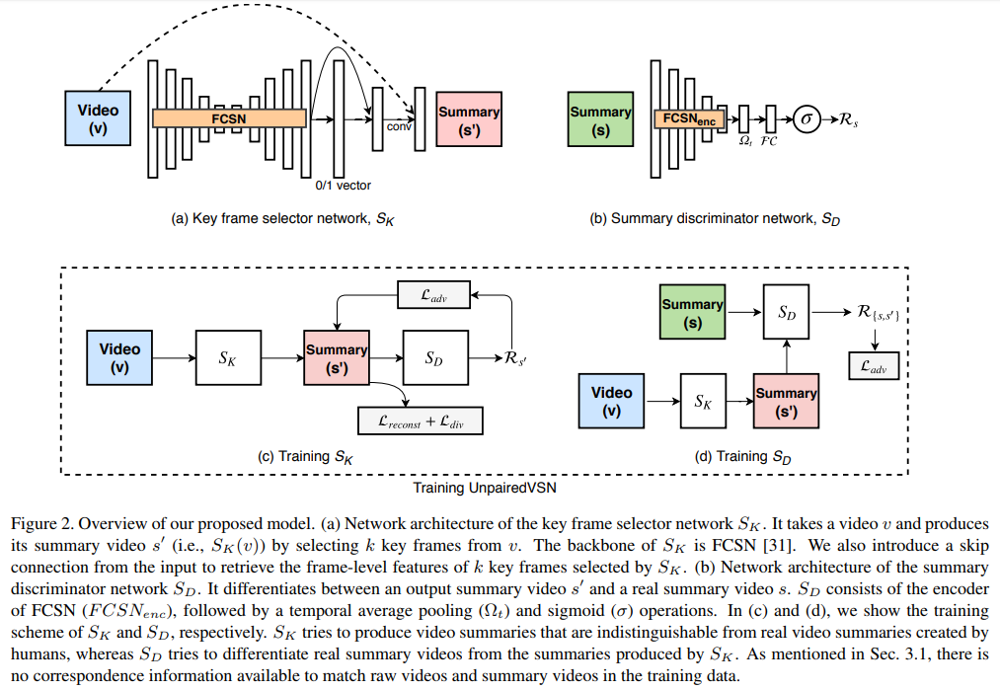
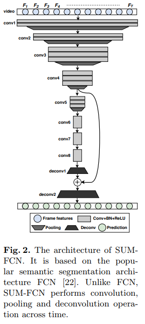
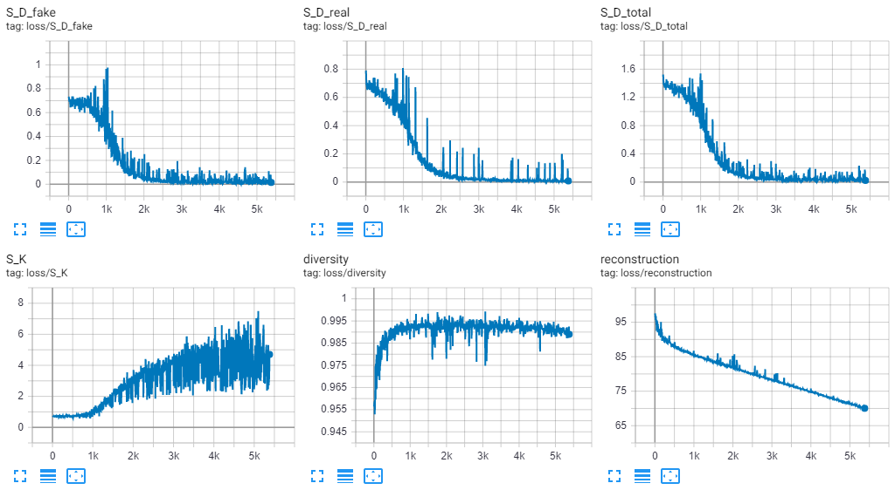

# pytorch-VSLUD
This is the implementation of the paper [Video
Summarization by Learning from Unpaired Data(CVPR2019)](http://openaccess.thecvf.com/content_CVPR_2019/papers/Rochan_Video_Summarization_by_Learning_From_Unpaired_Data_CVPR_2019_paper.pdf)

The FCSN architecture in above image is from [Video Summarization Using Fully Convolutional
Sequence Networks(ECCV2018)](http://openaccess.thecvf.com/content_ECCV_2018/papers/Mrigank_Rochan_Video_Summarization_Using_ECCV_2018_paper.pdf)

## Environment
- Ubuntu 18.04.1 LTS
- python 3.6.7
- numpy 1.15.4
- pytorch 1.1.0
- torchvision 0.3.0
- tqdm 4.32.1
- tensorboardX 1.6

## Get started
### 1. clone the project
    $ cd && git clone https://github.com/pcshih/pytorch-VSLUD.git && cd pytorch-VSLUD
### 2. create dir for saving models
    $ mkdir saved_models
### 3. download [datasets.zip](https://drive.google.com/open?id=19TPsAPi7z88I9Pi0TeCcoHJ5fcbF3Dzp)(this dataset is from [here](https://github.com/KaiyangZhou/pytorch-vsumm-reinforce/issues/23)) into the project folder and unzip it
    $ unzip datasets.zip 
### 4. run training_set_preparation.py for creating summe training set
    $ python3 training_set_preparation.py
### 5. train
    $ python3 train.py
### 6. start tensorboardX to view the loss curves
    $ tensorboard --logdir runs --port 6006

## Problems

Sorry for my poor coding, I am new to pytorch and deep learning.

The loss curves above are not reasonable during GAN training.

"The decoder of FCSN consists of several temporal deconvolution operations which produces a vector of prediction scores with the same length as the input video. Each score indicates the likelihood of the corresponding frame being a key frame or non-key frame. Based on these scores, we select k key frames to form the predicted summary video." -> found in the paper Video
[Summarization by Learning from Unpaired Data(CVPR2019)](http://openaccess.thecvf.com/content_CVPR_2019/papers/Rochan_Video_Summarization_by_Learning_From_Unpaired_Data_CVPR_2019_paper.pdf)

I implement "we select k key frames to form the predicted summary video" by [torch.index_select(input, dim, index, out=None)](https://pytorch.org/docs/stable/torch.html)

Is the function [torch.index_select(input, dim, index, out=None)](https://pytorch.org/docs/stable/torch.html) differentiable during training?Is this the main problem to cause the training to death?

Please feel free to [contact](pcshih.cs07g@nctu.edu.tw) me or disscuss on issues if you have any suggestions.

I am all gratitude.